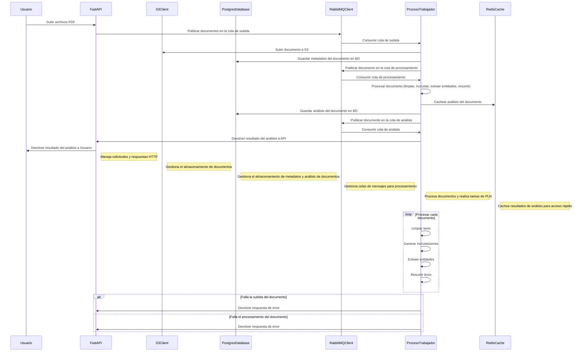

```mermaid
sequenceDiagram
    participant Usuario
    participant API as FastAPI
    participant S3 as S3Client
    participant BD as PostgresDatabase
    participant MQ as RabbitMQClient
    participant Trabajador as ProcesoTrabajador
    participant Redis as RedisCache

    Usuario->>API: Subir archivos PDF
    API->>MQ: Publicar documentos en la cola de subida
    MQ->>Trabajador: Consumir cola de subida
    Trabajador->>S3: Subir documento a S3
    Trabajador->>BD: Guardar metadatos del documento en BD
    Trabajador->>MQ: Publicar documento en la cola de procesamiento
    MQ->>Trabajador: Consumir cola de procesamiento
    Trabajador->>Trabajador: Procesar documento (limpiar, incrustar, extraer entidades, resumir)
    Trabajador->>Redis: Cachear análisis del documento
    Trabajador->>BD: Guardar análisis del documento en BD
    Trabajador->>MQ: Publicar documento en la cola de análisis
    MQ->>Trabajador: Consumir cola de análisis
    Trabajador->>API: Devolver resultado del análisis a API
    API->>Usuario: Devolver resultado del análisis a Usuario

    Note right of API: Maneja solicitudes y respuestas HTTP
    Note right of S3: Gestiona el almacenamiento de documentos
    Note right of BD: Gestiona el almacenamiento de metadatos y análisis de documentos
    Note right of MQ: Gestiona colas de mensajes para procesamiento
    Note right of Trabajador: Procesa documentos y realiza tareas de PLN
    Note right of Redis: Cachea resultados de análisis para acceso rápido

    loop Procesar cada documento
        Trabajador->>Trabajador: Limpiar texto
        Trabajador->>Trabajador: Generar incrustaciones
        Trabajador->>Trabajador: Extraer entidades
        Trabajador->>Trabajador: Resumir texto
    end

    alt Falla la subida del documento
        Trabajador->>API: Devolver respuesta de error
    else Falla el procesamiento del documento
        Trabajador->>API: Devolver respuesta de error
    end
```